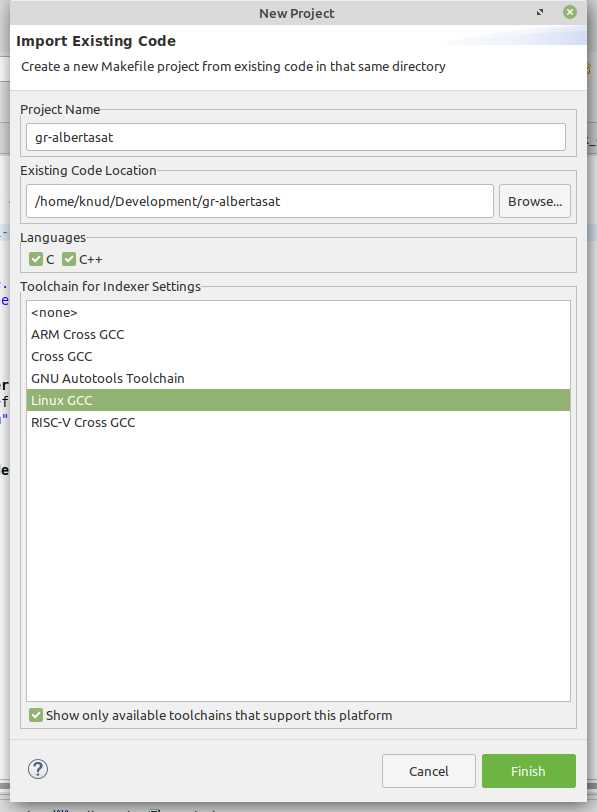
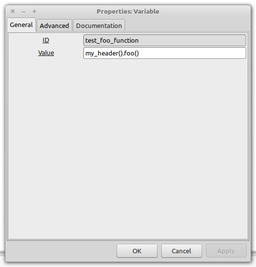

## GNU Radio HOWTO - Simple `noblock`example

1. Create a new module
   ```
   gr_modtool newmod albertasat
   cd gr-albertasat
   ```

2. Add a new `noblock` block
   ```
   knud 09:09:57 $gr_modtool add my_header
   GNU Radio module name identified: albertasat
   ('sink', 'source', 'sync', 'decimator', 'interpolator', 'general', 'tagged_stream', 'hier', 'noblock')
   Enter block type: noblock
   Language (python/cpp): cpp
   Language: C++
   Block/code identifier: my_header
   Enter valid argument list, including default arguments:
   Add C++ QA code? [Y/n]
   Adding file 'lib/my_header.cc'...
   Adding file 'include/albertasat/my_header.h'...
   Adding file 'lib/qa_my_header.cc'...
   Adding file 'lib/qa_my_header.h'...
   Editing swig/albertasat_swig.i...
   Adding file 'grc/albertasat_my_header.xml'...
   Editing grc/CMakeLists.txt...
   knud 09:10:01 $
   ```
3. Now is a good time to make an Eclipse CDT project. Choose File/New/Makefile Project with Existing Code. Set it up as shown below,being sure to navigate to the `gr-albertasat` directory.

   

4. You should not need to make sure that GNU Radio includes can be found, but if you do start by right-clicking the project folder in Eclipse and opening its properties.
    * Navigate to C/C++ General/Paths and Symbols. Select `GNU C` and click Add.  
    * Type or browse to get the path the the GNU Radio includes, which is probably `/usr/local/include/gnuradio`, but could be `/usr/include/gnuradio`

   

   

   

   

5. After all that, your project will know about the GNU Radio includes, which is evident in the image below.

   

6. Back to making the `noblock` block. The next step is to make sure that `my_packet` will be known by `gnuradio-companion` (hereafter we'll say `GRC`). Since this is a `noblock`, we can't see it as a block in GRC, so we remove it. Open `grc/CMakeLists.txt` and remove the line in the `install` block
   ```
   albertasat_my_header.xml
   ```
7. Now we make the appropriate changes and addtions to the `swig` directory. `cd swig` and make the `albertasat_swig.i` file look like
   ```
   /* -*- c++ -*- */

   #define ALBERTASAT_API

   %include "gnuradio.i"			// the common stuff

   //load generated python docstrings
   %include "albertasat_swig_doc.i"

   #pragma SWIG nowarn=325,454

   %{
   #include "albertasat/my_header.h"
   %}

   %include "albertasat/my_header.h"

   // Properly package up non-block objects
   %include "my_header.i"
   ```
   We are telling SWIG about the C++ interface for `my_header` and a new pointer based interface in `my_header.i`
8. Next we edit `CMakeLists.txt` to include `my_header.i`. At the bottom of the file, add `my_header.i` to the `install` block so it looks like this
   ```
   ########################################################################
   # Install swig .i files for development
   ########################################################################
   install(
       FILES
       albertasat_swig.i
       my_header.i
       ${CMAKE_CURRENT_BINARY_DIR}/albertasat_swig_doc.i
       DESTINATION ${GR_INCLUDE_DIR}/albertasat/swig
   )
   ```
9. Add a new file to the `swig` directory named `my_header.i` with the contents
    ```
    /* -*- c++ -*- */

    %template(my_header_sptr) boost::shared_ptr<gr::albertasat::my_header>;
    %pythoncode %{
    my_header_sptr.__repr__ = lambda self: "<my_header>"
    my_header = my_header .make;
    %}
    ```
10. Finally, let's change the header and implemenation files. `cd ..` and open `include/albertasat/my_header.h`. Make it look like
    ```
    #ifndef INCLUDED_ALBERTASAT_MY_HEADER_H
    #define INCLUDED_ALBERTASAT_MY_HEADER_H

    #include <albertasat/api.h>
    #include <boost/enable_shared_from_this.hpp>

    namespace gr {
      namespace albertasat {

        /*!
         * \brief <+description+>
         *
         */
        class ALBERTASAT_API my_header
        : public boost::enable_shared_from_this<gr::albertasat::my_header>
        {
        public:
          typedef boost::shared_ptr<my_header> sptr;

          ~my_header();

         static sptr make();

         int foo();

        private:
          my_header();
        };

      } // namespace albertasat
    } // namespace gr

    #endif /* INCLUDED_ALBERTASAT_MY_HEADER_H */    
    ```
    We add the Boost header to enable shared pointers, then make sure that `my_header` is based on it, define a shared pointer type, `sptr`, a `make()` function that will return a shared pointer to a single instance of `my_header`, and finally a dummy method `foo()` to test if a `my_header` object is shared and can be used.
11. Open `lib/my_header.cc` and make it look like
    ```
    #ifdef HAVE_CONFIG_H
    #include "config.h"
    #endif

    #include <gnuradio/io_signature.h>
    #include <albertasat/my_header.h>

    namespace gr {
      namespace albertasat {

        my_header::my_header()
        {
        }

        my_header::~my_header()
        {
        }

        my_header::sptr
        my_header::make()
        {
          return my_header::sptr (
    	      new my_header());
        }

        int
        my_header::foo()
        {
          return 17;
        }

      } /* namespace albertasat */
    } /* namespace gr */
    ```
12. Now do the usual GNU Radio module build
    ```
    mkdir build; cd build
    cmake ../
    make
    sudo make install
    sudo ldconfig
    ```
13. Time to test our `noblock`. Start an interactive `python2.7` session and do the following
    ```
    knud 22:33:50 $python2.7
    Python 2.7.17 (default, Sep 30 2020, 13:38:04)
    [GCC 7.5.0] on linux2
    Type "help", "copyright", "credits" or "license" for more information.
    >>> import albertasat
    >>> dir(albertasat)
    ['__builtins__', '__doc__', '__file__', '__name__', '__package__', '__path__', '_albertasat_swig', 'albertasat_swig', 'high_res_timer_epoch', 'high_res_timer_now', 'high_res_timer_now_perfmon', 'high_res_timer_tps', 'my_header', 'my_header_make', 'my_header_sptr', 'my_header_sptr_swigregister', 'my_header_swigregister']
    >>> albertasat.my_header().foo()
    17
    >>>
    knud 22:34:16 $
    ```
    We see that the `albertasat` module can be imported and contains the `my_header` class. The shared pointer is mapped in `my_header.i` allowing us to "pretend" to construct an instance of `my_header` and call `foo()`, which returns `17` as expected.
14. The last thing to do is confirm this works in GRC. Open GRC and create a new `QT GUI` model (doesn't have to be a QT model, but that's what you get when typing `Ctrl-N`). Name it something like `my_header_test.grc`. Add an import block and a variable block and set up as shown below.

    

    

    Now the variable block should display the value `17`, showing that the `my_header` instance was obtained and `foo()` called.

    
